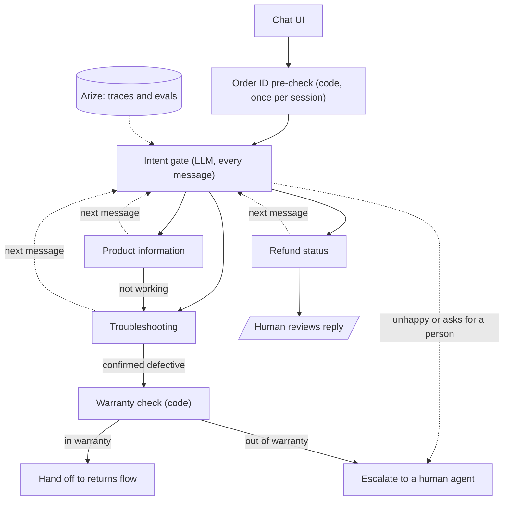

# Architecture (Version 1)

```mermaid
flowchart TD
    UI[Chat UI] --> PRE["Order ID pre-check (code, once per session)"]
    PRE --> INT["Intent gate (LLM, every message)"]
    INT --> PI[Product information]
    INT --> TS[Troubleshooting]
    INT --> RS[Refund status]
    PI -->|not working| TS
    INT -.->|unhappy or asks for a person| ESC[Escalate to a human agent]
    TS -->|confirmed defective| WAR["Warranty check (code)"]
    WAR -->|in warranty| RET[Hand off to returns flow]
    WAR -->|out of warranty| ESC
    RS --> REV[/Human reviews reply/]
    PI & TS & RS -.->|next message| INT
    OBS[(Arize: traces and evals)] -.-> INT
```

The full design, including Version 2, is in the team scratchpad.
